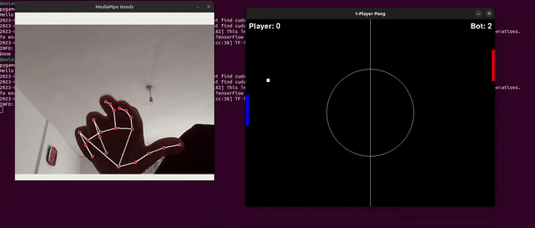

# HandMotion_Pong

HandMotion_Pong is a gesture-controlled Pong game where players can use their hand gestures to control their paddles. The game utilizes OpenCV and Mediapipe to capture hand movements and calculates the distance between the finger tip and mcp joint, mapping it to paddle movements.



## Features

- Classic Pong gameplay with basic opponent which just follows the y coordinate of the ball.
- Gesture-controlled player paddle using hand movements.
- Real-time hand tracking with OpenCV and Mediapipe.

## Requirements

- Python 3.x
- Pygame
- OpenCV
- Mediapipe

## Installation and Play

1. Clone the repository:

```bash
git clone https://github.com/denizydmr07/HandMotion_Pong.git
cd HandMotion_Pong
```

2. Install dependencies using pip:
   
```bash
pip install -r requirements.txt
```

3. Run the game:

```bash
python Game.py

```
